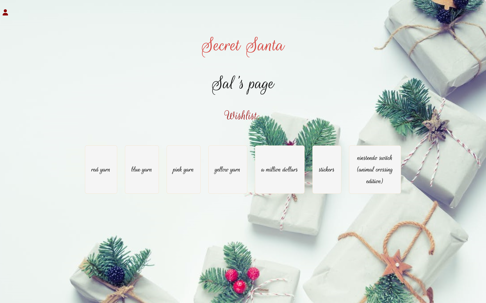

  #  Secret Santa

  ### Table of Contents 

  - [Installation](#installation)
  - [Usage](#usage)
  - [Credits](#credits)
  - [License](#license)
  - [Demo](#demo)
  - [Contact](#contact)

  ## Description
  This application allows the users to partake in Secret Santa without the hassle. With the help from our application, we are able to simplify the holiday season by helping you pick your chosen person, and be able to create a wishlist	

  ## Installation
  This application will require the following tools: 
  Dependacies: 
   - `bcrypt 5.0.0`
   - `connect-session-sequelize 7.0.4`
   - `Dotenv 8.2.0`
   - `express 4.17.1`
   - `express-handlebars 5.2.0`
   - `express-session 1.17.1`
   - `mysql2 2.2.5`
   - `sequelize 6.3.5`
   
   Dev-dependacies
   - `eslint 7.12.1`
   - `eslint-config-prettierm 6.15.0`
   - `prettie: 2.1.2`
   - `nodemon 3.0.2`

  ## Usage
  
To run this project, follow the following steps: 
1. clone this repository :
    * `git clone git@github.com:chadedwardsofficial/Secret-Santa.git`
2. Once cloned, open your terminal and run the following lines in order:
    1. `npm i` to install all packages used
    2. `mysql -u - root  -p` and type in your password for mysql 
    3. `source ./db/schema.sql`. Be sure to be in the correct folder to run your schema, if already in your db folder then type `source schema.sql`.
    4. `Exit` to exit out of mysql.
    5. `Npm run seed` to seed the initial data into the database. 
    6. `Npm start` to initiate the application.
3. Once you have the code running, you will be able to open the application through the designated localhost:3001 
4. Once at the homepage you should be able to click the login button located on the top left hand side.  From here you should be able to either log in to your account or be able to create an account. 
5. Once logged in/ have created your account, you are able to click the `Chosen Person` button that will generate your chosen person for secret Santa. Once closing the modal, your profile page should update to tell you who is your chosen person. 
6. If you want to add items to your wishlist, enter the items name under the title `Item Name` and once done typing, click ` Add Item` to save your item to your wishlist. 
7. To be able to view your chosen persons wishlist, head back to the homepage by clicking the `Secret Santa` title and in the bottom there should be a list of names. Click on your selected persons name and you will be redirected to their wishlist page. 
8. Have fun and enjoy your Secret Santa experience! 

  ## Credits
  this was done in partnership with [chadedwardsofficial](https://github.com/), [H3yJ4yy](https://github.com/), and [tonyG4A](https://github.com/) as well as help from our teacher Tyler Calvert and teacher assistant Dustin Burns
  
  ## License
  none 
 
  ## Demo
  The Homepage
  
  The Login/Sign-up Page
  
  The Profile Page
  
  The Wishlist Page
  

  ### Contact 
  For any further questions, feel free to contact us through my GitHub: 
  - [chadedwardsofficial](https://github.com/)
  - [H3yJ4yy](https://github.com/)
  - [tonyG4A](https://github.com/) 

  or Email :

  - [Chad Edwards](mailto:chadedwardsofficial@gmail.com)
  - [Andrea Gonzalez](mailto:agon0015@gmail.com)
  - [Anthony Guerra](mailto:tx.tony9@gmail.com)
